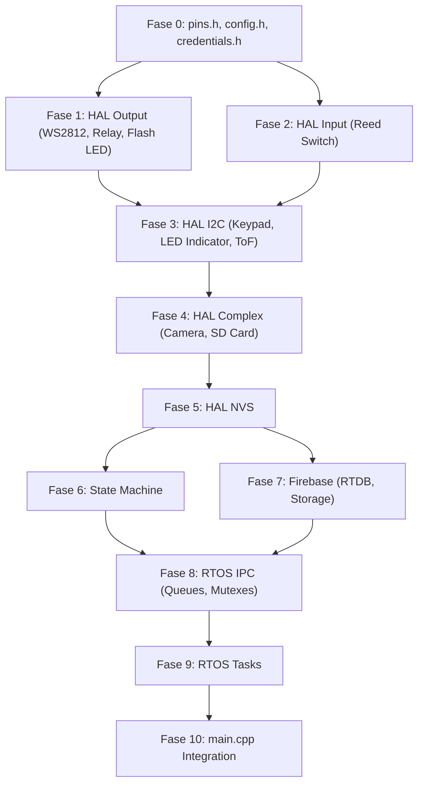

# Square Smart Parcel Box — Implementation Plan

## Background

Project ini adalah firmware ESP32-S3 untuk **Square Smart Parcel Box**, sebuah IoT parcel box yang memungkinkan kurir memasukkan paket dengan PIN terbatas, mengambil foto/video bukti, dan menyinkronkan data ke Firebase. Proyek menggunakan **PlatformIO + Arduino framework + FreeRTOS**.

Saat ini proyek masih kosong (hanya skeleton `main.cpp`). Rencana ini memecah seluruh firmware menjadi **10 fase** yang berurutan, di mana setiap fase menghasilkan komponen yang **bisa diuji secara independen** melalui serial monitor dan/atau unit test sederhana.

---

## Open Questions

> [!IMPORTANT]
> **Q1:** Apakah Anda ingin menggunakan framework testing formal (seperti `Unity` test framework bawaan PlatformIO) untuk unit test, atau cukup dengan test manual via serial monitor + sketch test sederhana?

> [!IMPORTANT]
> **Q2:** Apakah credentials (Wi-Fi SSID, Firebase keys, dll.) sudah tersedia dan siap diisi, atau harus dibuat placeholder terlebih dahulu?

> [!IMPORTANT]
> **Q3:** Untuk `upload_queue.txt`, apakah format setiap baris cukup berisi nama file (e.g., `img_1752587495.jpg`) satu per baris?

---

## Proposed Changes

Semua file baru mengikuti struktur dari Section 9 FSD:

```
src/
├── main.cpp
├── pins.h
├── credentials.h
├── config.h
├── hal/
│   ├── ws2812.h / .cpp
│   ├── relay.h / .cpp
│   ├── flash_led.h / .cpp
│   ├── reed_switch.h / .cpp
│   ├── tof.h / .cpp
│   ├── camera.h / .cpp
│   ├── sdcard.h / .cpp
│   ├── keypad_driver.h / .cpp
│   ├── keybuffer_indicator_driver.h / .cpp
│   └── nvs_store.h / .cpp
├── tasks/
│   ├── task_network.h / .cpp
│   ├── task_keypad_led.h / .cpp
│   ├── task_statemachine.h / .cpp
│   └── task_media.h / .cpp
├── state/
│   └── state_machine.h / .cpp
└── firebase/
    ├── fb_rtdb.h / .cpp
    └── fb_storage.h / .cpp
```

---

## Fase 0 — Foundation Files (Pin Definitions, Config, Credentials)

File-file dasar yang menjadi dependensi semua modul lain. **Tidak ada logika yang perlu diuji**, hanya konstanta.

---

### [NEW] [pins.h](file:///c:/Users/rafae/Forgor/ForgorEmbedded/PlatformIO/Square-SmartParcelBox/src/pins.h)

Satu-satunya sumber definisi pin. Semua GPIO, alamat I2C, dan pin PCF8574 didefinisikan di sini.

**Konstanta yang harus didefinisikan:**

| Kategori | Konstanta | Nilai | Catatan |
|---|---|---|---|
| WS2812 | `PIN_LED_WS2812` | `48` | RGB status LED |
| Relay | `PIN_RELAY_SOLENOID` | `14` | Active HIGH |
| Flash | `PIN_AUX_FLASH` | `2` | MOSFET gate |
| Reed Switch | `PIN_DOOR_SWITCH` | `1` | INPUT_PULLUP |
| I2C | `PIN_SDA` | `21` | Shared I2C bus |
| I2C | `PIN_SCL` | `47` | Shared I2C bus |
| I2C Addr | `I2C_ADDR_KEYPAD` | `0x20` | PCF8574 keypad |
| I2C Addr | `I2C_ADDR_LED_IND` | `0x21` | PCF8574 LED |
| I2C Addr | `I2C_ADDR_TOF` | `0x29` | VL53L0X |
| Camera | `PIN_CAM_D0` – `PIN_CAM_D7` | `11,9,8,10,12,18,17,16` | DVP data |
| Camera | `PIN_CAM_XCLK` | `15` | 20MHz clock |
| Camera | `PIN_CAM_PCLK` | `13` | Pixel clock |
| Camera | `PIN_CAM_VSYNC` | `6` | Vertical sync |
| Camera | `PIN_CAM_HREF` | `7` | Horizontal ref |
| Camera | `PIN_CAM_SIOD` | `4` | SCCB data |
| Camera | `PIN_CAM_SIOC` | `5` | SCCB clock |
| SD Card | `PIN_SD_DATA` | `40` | 1-bit mode |
| SD Card | `PIN_SD_CLK` | `39` | Clock |
| SD Card | `PIN_SD_CMD` | `38` | Command |

---

### [NEW] [credentials.h](file:///c:/Users/rafae/Forgor/ForgorEmbedded/PlatformIO/Square-SmartParcelBox/src/credentials.h)

Hardcoded credentials sesuai NCC-006.

**Konstanta yang harus didefinisikan:**

```cpp
#define WIFI_SSID             "your_ssid"
#define WIFI_PASSWORD         "your_password"
#define FIREBASE_DATABASE_URL "project-id-default-rtdb.firebaseio.com"
#define FIREBASE_WEBAPI_KEY   "your_web_api_key"
#define FIREBASE_STORAGE_BUCKET "your_bucket.appspot.com"
#define DEVICE_EMAIL          "device@example.com"
#define DEVICE_PASSWORD       "device_password"
#define USER_UID              "firebase_user_uid"
```

---

### [NEW] [config.h](file:///c:/Users/rafae/Forgor/ForgorEmbedded/PlatformIO/Square-SmartParcelBox/src/config.h)

Non-pin constants: thresholds, timeouts, sizes.

**Konstanta yang harus didefinisikan:**

| Konstanta | Nilai | Sumber FSD |
|---|---|---|
| `TOF_THRESHOLD_CM` | `38` | NCC-001, Section 4.3.7 |
| `TOF_BOX_WIDTH_CM` | `40` | Section 4.3.7 |
| `DOOR_TIMEOUT_MS` | `10000` | SFS-004 |
| `HEARTBEAT_INTERVAL_MS` | `30000` | NCC-008 |
| `WIFI_MAX_RETRIES` | `25` | SFS-006 |
| `WIFI_RETRY_DELAY_MS` | `300` | SFS-006 |
| `FLASH_WARMUP_MS` | `1000` | Section 4.3.5 |
| `SD_MIN_FREE_MB` | `50` | CVL-008 |
| `PIN_LENGTH` | `4` | ACC-001 |
| `RTDB_QUEUE_DEPTH` | `10` | Section 6.5 |
| `COMMAND_QUEUE_DEPTH` | `3` | Section 6.5 |
| `RETRY_FIRST_FAIL_MS` | `300000` (5 min) | Section 4.3.8 |
| `RETRY_SUBSEQUENT_MS` | `900000` (15 min) | Section 4.3.8 |
| `KEYPAD_DEBOUNCE_MS` | `200` | ACC-008 |
| `LED_ALT_INTERVAL_MS` | `250` | Section 4.2.3 |
| `ERROR_LOG_INTERVAL_MS` | `1000` | DBG-012 |
| `WS2812_BLINK_INTERVAL_MS` | `1000` | Section 6.7 |
| `RTOS_MIN_DELAY_MS` | `10` | SFS-009 |

---

## Fase 1 — HAL: Simple Output Drivers (WS2812, Relay, Flash LED)

Driver output sederhana yang **tidak memerlukan I2C** dan bisa diuji langsung.

---

### [NEW] [ws2812.h](file:///c:/Users/rafae/Forgor/ForgorEmbedded/PlatformIO/Square-SmartParcelBox/src/hal/ws2812.h) / [ws2812.cpp](file:///c:/Users/rafae/Forgor/ForgorEmbedded/PlatformIO/Square-SmartParcelBox/src/hal/ws2812.cpp)

WS2812 RGB LED driver. Wrapper around `Adafruit_NeoPixel`.

**Enum yang harus didefinisikan:**

```cpp
enum WS2812Pattern {
    WS2812_OFF,
    WS2812_RED_BLUE_BLINK,   // Startup: blink merah-biru tiap 1 detik
    WS2812_SOLID_BLUE,       // Wi-Fi connected
    WS2812_SOLID_GREEN,      // Firebase connected, no HW issues
    WS2812_SOLID_YELLOW,     // Firebase connected, partial HW issues
    WS2812_SOLID_PURPLE,     // Offline mode with NVS pins
    WS2812_SOLID_RED          // Fatal error / STATE_ERROR
};
```

**Fungsi yang harus dibuat:**

| Fungsi | Signature | Deskripsi | Cara Uji |
|---|---|---|---|
| `ws2812_init` | `bool ws2812_init()` | Inisialisasi NeoPixel pada `PIN_LED_WS2812`. Return `true` jika berhasil. | Panggil di `setup()`, cek LED menyala. |
| `ws2812_set_pattern` | `void ws2812_set_pattern(WS2812Pattern pattern)` | Set pola LED saat ini. Menyimpan pattern ke variable internal. | Panggil dengan berbagai pattern, verifikasi warna LED secara visual. |
| `ws2812_update` | `void ws2812_update()` | Dipanggil di loop task untuk mengupdate animasi (blink). Harus non-blocking, menggunakan `millis()`. | Panggil dalam loop, verifikasi blink bekerja. |

---

### [NEW] [relay.h](file:///c:/Users/rafae/Forgor/ForgorEmbedded/PlatformIO/Square-SmartParcelBox/src/hal/relay.h) / [relay.cpp](file:///c:/Users/rafae/Forgor/ForgorEmbedded/PlatformIO/Square-SmartParcelBox/src/hal/relay.cpp)

Solenoid relay driver. Active HIGH.

**Fungsi yang harus dibuat:**

| Fungsi | Signature | Deskripsi | Cara Uji |
|---|---|---|---|
| `relay_init` | `bool relay_init()` | Inisialisasi GPIO `PIN_RELAY_SOLENOID` sebagai OUTPUT, set LOW (locked). Return `true`. | Panggil di `setup()`, pastikan solenoid terkunci. |
| `relay_unlock` | `void relay_unlock()` | Set pin HIGH untuk membuka solenoid. | Panggil, verifikasi solenoid terbuka. |
| `relay_lock` | `void relay_lock()` | Set pin LOW untuk mengunci solenoid. | Panggil, verifikasi solenoid terkunci. |
| `relay_is_unlocked` | `bool relay_is_unlocked()` | Return status pin saat ini (`HIGH` = unlocked). | Panggil setelah `unlock`/`lock`, verifikasi via Serial. |

---

### [NEW] [flash_led.h](file:///c:/Users/rafae/Forgor/ForgorEmbedded/PlatformIO/Square-SmartParcelBox/src/hal/flash_led.h) / [flash_led.cpp](file:///c:/Users/rafae/Forgor/ForgorEmbedded/PlatformIO/Square-SmartParcelBox/src/hal/flash_led.cpp)

Auxiliary flash LED driver (MOSFET-driven). Active HIGH.

**Fungsi yang harus dibuat:**

| Fungsi | Signature | Deskripsi | Cara Uji |
|---|---|---|---|
| `flash_led_init` | `bool flash_led_init()` | Inisialisasi GPIO `PIN_AUX_FLASH` sebagai OUTPUT, set LOW (off). Return `true`. | Panggil di `setup()`. |
| `flash_led_on` | `void flash_led_on()` | Nyalakan flash LED (HIGH). | Panggil, verifikasi LED menyala. |
| `flash_led_off` | `void flash_led_off()` | Matikan flash LED (LOW). | Panggil, verifikasi LED mati. |

---

## Fase 2 — HAL: Simple Input Driver (Reed Switch)

---

### [NEW] [reed_switch.h](file:///c:/Users/rafae/Forgor/ForgorEmbedded/PlatformIO/Square-SmartParcelBox/src/hal/reed_switch.h) / [reed_switch.cpp](file:///c:/Users/rafae/Forgor/ForgorEmbedded/PlatformIO/Square-SmartParcelBox/src/hal/reed_switch.cpp)

Magnetic reed switch driver. Closed = HIGH, Open = LOW.

**Fungsi yang harus dibuat:**

| Fungsi | Signature | Deskripsi | Cara Uji |
|---|---|---|---|
| `reed_switch_init` | `bool reed_switch_init()` | Inisialisasi GPIO `PIN_DOOR_SWITCH` sebagai `INPUT_PULLUP`. Return `true`. | Panggil di `setup()`. |
| `reed_switch_is_closed` | `bool reed_switch_is_closed()` | Return `true` jika pin HIGH (pintu tertutup). | Buka/tutup pintu, print ke Serial. |
| `reed_switch_is_open` | `bool reed_switch_is_open()` | Return `true` jika pin LOW (pintu terbuka). Kebalikan dari `is_closed`. | Buka/tutup pintu, print ke Serial. |

---

## Fase 3 — HAL: I2C Drivers (Keypad, LED Indicator, ToF)

Semua perangkat I2C pada bus yang sama. Memerlukan `I2C_Mutex` untuk akses bersama, tetapi di fase ini diuji **tanpa mutex** (single-threaded).

---

### [NEW] [keypad_driver.h](file:///c:/Users/rafae/Forgor/ForgorEmbedded/PlatformIO/Square-SmartParcelBox/src/hal/keypad_driver.h) / [keypad_driver.cpp](file:///c:/Users/rafae/Forgor/ForgorEmbedded/PlatformIO/Square-SmartParcelBox/src/hal/keypad_driver.cpp)

Custom 3x4 matrix keypad library via PCF8574 (ACC-009). Mengimplementasi row-scanning dengan debounce (ACC-008).

**Fungsi yang harus dibuat:**

| Fungsi | Signature | Deskripsi | Cara Uji |
|---|---|---|---|
| `keypad_init` | `bool keypad_init(TwoWire &wire)` | Inisialisasi I2C pada alamat `I2C_ADDR_KEYPAD`. Verifikasi PCF8574 merespons. Return `true`/`false`. | Panggil di `setup()`, cek log `SUCCESS`/`FAILED`. |
| `keypad_scan` | `char keypad_scan()` | Scan satu siklus penuh matrix keypad. Return karakter tombol yang ditekan (`'0'`–`'9'`, `'*'`, `'#'`) atau `'\0'` jika tidak ada. Implementasi debounce internal. HARUS mengabaikan `'*'` dan `'#'` (ACC-010). | Panggil dalam loop, print karakter ke Serial. Verifikasi setiap tekan = satu karakter (ACC-008). |
| `keypad_is_available` | `bool keypad_is_available()` | Return `true` jika init berhasil dan PCF8574 merespons. | Cabut I2C, verifikasi return `false`. |

**Detail implementasi `keypad_scan`:**
1. Untuk setiap row (R1-R4): set row LOW, baca kolom (C1-C3).
2. Jika ada kolom LOW, decode posisi ke karakter.
3. Debounce: hanya return karakter jika tombol stabil selama `KEYPAD_DEBOUNCE_MS`.
4. Edge detection: hanya return karakter pada transisi press→release atau idle→press, BUKAN saat hold.
5. Ignore `'*'` dan `'#'` → return `'\0'`.

---

### [NEW] [keybuffer_indicator_driver.h](file:///c:/Users/rafae/Forgor/ForgorEmbedded/PlatformIO/Square-SmartParcelBox/src/hal/keybuffer_indicator_driver.h) / [keybuffer_indicator_driver.cpp](file:///c:/Users/rafae/Forgor/ForgorEmbedded/PlatformIO/Square-SmartParcelBox/src/hal/keybuffer_indicator_driver.cpp)

4x LED indicator via PCF8574 (Active LOW).

**Fungsi yang harus dibuat:**

| Fungsi | Signature | Deskripsi | Cara Uji |
|---|---|---|---|
| `led_indicator_init` | `bool led_indicator_init(TwoWire &wire)` | Inisialisasi I2C pada alamat `I2C_ADDR_LED_IND`. Set semua LED OFF (all bits HIGH karena active LOW). Return `true`/`false`. | Panggil, verifikasi semua LED mati. |
| `led_indicator_set_count` | `void led_indicator_set_count(uint8_t count)` | Nyalakan LED 0 s/d `count-1`. `count=0` semua mati, `count=4` semua nyala. | Panggil dengan 0–4, verifikasi visual. |
| `led_indicator_all_off` | `void led_indicator_all_off()` | Matikan semua LED. Shortcut untuk `set_count(0)`. | Verifikasi visual. |
| `led_indicator_alternating_pattern` | `void led_indicator_alternating_pattern()` | Animasi bergantian kiri-kanan sesuai Section 4.2.3 (250ms interval). Non-blocking, gunakan `millis()`. | Panggil dalam loop, verifikasi pola. |
| `led_indicator_stop_pattern` | `void led_indicator_stop_pattern()` | Hentikan pola animasi dan matikan semua LED. | Panggil setelah animasi berjalan. |
| `led_indicator_is_available` | `bool led_indicator_is_available()` | Return `true` jika init berhasil. | Cek return value. |

---

### [NEW] [tof.h](file:///c:/Users/rafae/Forgor/ForgorEmbedded/PlatformIO/Square-SmartParcelBox/src/hal/tof.h) / [tof.cpp](file:///c:/Users/rafae/Forgor/ForgorEmbedded/PlatformIO/Square-SmartParcelBox/src/hal/tof.cpp)

VL53L0X Time-of-Flight sensor driver via `Adafruit_VL53L0X`.

**Fungsi yang harus dibuat:**

| Fungsi | Signature | Deskripsi | Cara Uji |
|---|---|---|---|
| `tof_init` | `bool tof_init(TwoWire &wire)` | Inisialisasi VL53L0X pada alamat `I2C_ADDR_TOF`. Return `true`/`false`. | Panggil, cek log. |
| `tof_read_distance_cm` | `int16_t tof_read_distance_cm()` | Baca jarak dalam cm. Return `-1` jika gagal/timeout. | Letakkan objek di depan sensor, print jarak. |
| `tof_is_full` | `bool tof_is_full()` | Return `true` jika `tof_read_distance_cm() < TOF_THRESHOLD_CM`. Sesuai NCC-001. | Blokir/buka sensor, verifikasi output. |
| `tof_is_available` | `bool tof_is_available()` | Return `true` jika init berhasil. | Cek return value. |

---

## Fase 4 — HAL: Camera & SD Card

Komponen yang lebih kompleks, masing-masing memiliki banyak fungsi.

---

### [NEW] [camera.h](file:///c:/Users/rafae/Forgor/ForgorEmbedded/PlatformIO/Square-SmartParcelBox/src/hal/camera.h) / [camera.cpp](file:///c:/Users/rafae/Forgor/ForgorEmbedded/PlatformIO/Square-SmartParcelBox/src/hal/camera.cpp)

OV2640 camera driver. Mendukung foto (UXGA/JPG 1600×1200) dan video (VGA/MJPEG 640×480).

**Fungsi yang harus dibuat:**

| Fungsi | Signature | Deskripsi | Cara Uji |
|---|---|---|---|
| `camera_init` | `bool camera_init()` | Inisialisasi kamera OV2640 dengan konfigurasi pin dari `pins.h`. Gunakan PSRAM untuk frame buffer. Default resolusi UXGA JPG. Return `true`/`false`. | Panggil, cek log SUCCESS/FAILED. |
| `camera_capture_photo` | `camera_fb_t* camera_capture_photo()` | Set resolusi ke UXGA, ambil satu frame. Return pointer ke frame buffer (caller harus memanggil `camera_return_fb`). Return `NULL` jika gagal. | Panggil, verifikasi `fb->len > 0`. |
| `camera_return_fb` | `void camera_return_fb(camera_fb_t* fb)` | Kembalikan frame buffer ke pool. | Panggil setelah `capture_photo`. |
| `camera_set_resolution_photo` | `void camera_set_resolution_photo()` | Set resolusi ke UXGA (1600×1200) JPG. | Panggil, ambil foto, verifikasi resolusi. |
| `camera_set_resolution_video` | `void camera_set_resolution_video()` | Set resolusi ke VGA (640×480) JPG (untuk MJPEG frames). | Panggil, ambil frame, verifikasi resolusi. |
| `camera_is_available` | `bool camera_is_available()` | Return `true` jika init berhasil. | Cek return value. |

---

### [NEW] [sdcard.h](file:///c:/Users/rafae/Forgor/ForgorEmbedded/PlatformIO/Square-SmartParcelBox/src/hal/sdcard.h) / [sdcard.cpp](file:///c:/Users/rafae/Forgor/ForgorEmbedded/PlatformIO/Square-SmartParcelBox/src/hal/sdcard.cpp)

MicroSD card driver. 1-bit SD_MMC mode. Mencakup file I/O, upload queue, dan FIFO cleanup.

**Fungsi yang harus dibuat:**

| Fungsi | Signature | Deskripsi | Cara Uji |
|---|---|---|---|
| `sdcard_init` | `bool sdcard_init()` | Mount SD card via `SD_MMC` 1-bit mode. Log tipe dan ukuran kartu (DBG-010). Return `true`/`false`. | Panggil, cek log. |
| `sdcard_write_test` | `bool sdcard_write_test()` | Tulis dan baca file dummy untuk verifikasi (DBG-008). Return `true` jika PASSED. | Panggil, cek log. |
| `sdcard_save_file` | `bool sdcard_save_file(const char* dir_path, const char* filename, const uint8_t* data, size_t len)` | Buat direktori `dir_path` jika belum ada, tulis data ke `dir_path/filename`. Return `true`/`false`. | Tulis data dummy, baca kembali, bandingkan. |
| `sdcard_read_file` | `bool sdcard_read_file(const char* filepath, uint8_t** out_data, size_t* out_len)` | Baca file ke buffer yang di-allocate (caller harus `free()`). Return `true`/`false`. | Baca file yang sudah ditulis, verifikasi isi. |
| `sdcard_file_exists` | `bool sdcard_file_exists(const char* filepath)` | Cek apakah file ada. | Cek file yang ada dan tidak ada. |
| `sdcard_delete_file` | `bool sdcard_delete_file(const char* filepath)` | Hapus file. Return `true`/`false`. | Hapus file, verifikasi tidak ada lagi. |
| `sdcard_delete_dir` | `bool sdcard_delete_dir(const char* dir_path)` | Hapus direktori beserta isinya. Return `true`/`false`. | Buat dir+file, hapus dir, verifikasi. |
| `sdcard_get_free_mb` | `uint32_t sdcard_get_free_mb()` | Return sisa ruang kosong dalam MB. | Print, verifikasi masuk akal. |
| `sdcard_queue_push_back` | `bool sdcard_queue_push_back(const char* filename)` | Tambahkan `filename` ke akhir `upload_queue.txt`. | Tambah beberapa entry, baca file, verifikasi urutan. |
| `sdcard_queue_push_front` | `bool sdcard_queue_push_front(const char* filename)` | Tambahkan `filename` ke depan `upload_queue.txt` (untuk prioritas on-demand). | Tambah entry, verifikasi posisi pertama. |
| `sdcard_queue_pop_front` | `bool sdcard_queue_pop_front(char* out_filename, size_t max_len)` | Ambil dan hapus entry pertama dari `upload_queue.txt`. Return `true` jika ada entry. | Push beberapa, pop satu per satu, verifikasi urutan FIFO. |
| `sdcard_queue_peek_front` | `bool sdcard_queue_peek_front(char* out_filename, size_t max_len)` | Lihat entry pertama tanpa menghapus. | Peek, verifikasi tidak hilang setelah peek. |
| `sdcard_queue_remove` | `bool sdcard_queue_remove(const char* filename)` | Hapus entry spesifik dari queue (untuk abort on-demand). | Push 3, remove tengah, verifikasi. |
| `sdcard_queue_is_empty` | `bool sdcard_queue_is_empty()` | Return `true` jika queue kosong. | Cek saat kosong dan saat ada isi. |
| `sdcard_fifo_cleanup` | `void sdcard_fifo_cleanup()` | Paired FIFO deletion (CVL-007, CVL-008): hapus pasangan img+vid terlama sampai free space ≥ `SD_MIN_FREE_MB`. | Buat banyak file dummy, panggil cleanup, verifikasi file terlama terhapus. |
| `sdcard_is_available` | `bool sdcard_is_available()` | Return `true` jika init berhasil. | Cek return value. |
| `sdcard_get_type_string` | `const char* sdcard_get_type_string()` | Return string tipe kartu ("SDHC", "SD", dll). | Print ke Serial. |
| `sdcard_get_size_mb` | `uint32_t sdcard_get_size_mb()` | Return ukuran kartu dalam MB. | Print ke Serial. |

---

## Fase 5 — HAL: NVS Storage

---

### [NEW] [nvs_store.h](file:///c:/Users/rafae/Forgor/ForgorEmbedded/PlatformIO/Square-SmartParcelBox/src/hal/nvs_store.h) / [nvs_store.cpp](file:///c:/Users/rafae/Forgor/ForgorEmbedded/PlatformIO/Square-SmartParcelBox/src/hal/nvs_store.cpp)

NVS Preferences wrapper untuk menyimpan active_pins sebagai JSON string (max 512 bytes). Menggunakan `ArduinoJson` untuk serialisasi.

**Fungsi yang harus dibuat:**

| Fungsi | Signature | Deskripsi | Cara Uji |
|---|---|---|---|
| `nvs_store_init` | `bool nvs_store_init()` | Inisialisasi Preferences namespace. Baca `active_pins` string jika ada. Return `true`/`false`. Log jumlah PIN aktif (DBG-011). | Panggil, cek log. |
| `nvs_store_get_pin_count` | `int nvs_store_get_pin_count()` | Return jumlah PIN aktif yang tersimpan. | Tambah PIN, verifikasi count. |
| `nvs_store_has_pins` | `bool nvs_store_has_pins()` | Return `true` jika ada minimal 1 PIN aktif. | Cek saat kosong dan saat ada PIN. |
| `nvs_store_verify_pin` | `bool nvs_store_verify_pin(const char* pin)` | Verifikasi PIN: return `true` jika PIN ada dan `used_quota < quota`. | Simpan PIN q=3 u=1, verifikasi true. Simpan PIN q=1 u=1, verifikasi false. |
| `nvs_store_increment_used` | `bool nvs_store_increment_used(const char* pin)` | Increment `used_quota` PIN. Jika `used_quota >= quota`, hapus PIN dari NVS (ACC-007). Return `true` jika berhasil. | Increment, cek count berkurang setelah habis. |
| `nvs_store_get_remaining_quota` | `int nvs_store_get_remaining_quota(const char* pin)` | Return sisa quota (`quota - used_quota`). Return `-1` jika PIN tidak ditemukan. | Cek sebelum/sesudah increment. |
| `nvs_store_save_pin` | `bool nvs_store_save_pin(const char* pin, int quota, int used_quota)` | Simpan/update satu PIN ke NVS. | Simpan, baca kembali, verifikasi. |
| `nvs_store_save_all_pins` | `bool nvs_store_save_all_pins(const char* json_str)` | Overwrite seluruh `active_pins` dengan JSON string baru (untuk sinkronisasi dari Firebase). | Simpan JSON, baca count, verifikasi. |
| `nvs_store_get_all_pins_json` | `String nvs_store_get_all_pins_json()` | Return JSON string dari semua active_pins saat ini. | Print ke Serial, verifikasi format. |
| `nvs_store_delete_pin` | `bool nvs_store_delete_pin(const char* pin)` | Hapus satu PIN spesifik dari NVS. | Hapus, verifikasi count berkurang. |
| `nvs_store_clear_all` | `void nvs_store_clear_all()` | Hapus semua PIN (untuk debugging). | Panggil, verifikasi `has_pins()` false. |
| `nvs_store_is_available` | `bool nvs_store_is_available()` | Return `true` jika init berhasil. | Cek return value. |

---

## Fase 6 — State Machine

---

### [NEW] [state_machine.h](file:///c:/Users/rafae/Forgor/ForgorEmbedded/PlatformIO/Square-SmartParcelBox/src/state/state_machine.h) / [state_machine.cpp](file:///c:/Users/rafae/Forgor/ForgorEmbedded/PlatformIO/Square-SmartParcelBox/src/state/state_machine.cpp)

State enum dan transition logic sesuai Section 6.6.

**Enum yang harus didefinisikan:**

```cpp
enum SystemState {
    STATE_START,
    STATE_IDLE,
    STATE_DELIVERY,
    STATE_ONDEMAND,
    STATE_ERROR
};

// Command enum untuk CommandQueue
enum RemoteCommand {
    CMD_NONE,
    CMD_UNLOCK,
    CMD_LOCK,
    CMD_LOCK_AND_UNLOCK,   // Conflict: prioritas lock (Section 5.1)
    CMD_REQUEST_PHOTO,
    CMD_REQUEST_VIDEO
};
```

**Fungsi yang harus dibuat:**

| Fungsi | Signature | Deskripsi | Cara Uji |
|---|---|---|---|
| `sm_init` | `void sm_init()` | Set state awal ke `STATE_START`. | Panggil, cek state. |
| `sm_get_state` | `SystemState sm_get_state()` | Return state saat ini. | Cek setelah init. |
| `sm_transition_to` | `bool sm_transition_to(SystemState new_state)` | Validasi dan eksekusi transisi. Return `false` jika transisi illegal (e.g., dari `STATE_ERROR` ke manapun). Log transisi ke Serial. | Coba semua transisi valid dan invalid. |
| `sm_is_idle` | `bool sm_is_idle()` | Shortcut: return `state == STATE_IDLE`. | Cek di berbagai state. |
| `sm_is_error` | `bool sm_is_error()` | Shortcut: return `state == STATE_ERROR`. | Cek di berbagai state. |
| `sm_get_state_name` | `const char* sm_get_state_name(SystemState state)` | Return string nama state untuk logging (e.g., `"STATE_IDLE"`). | Print semua state names. |

**Tabel transisi valid (enforce di `sm_transition_to`):**

| From | To | Valid? |
|---|---|---|
| `STATE_START` | `STATE_IDLE` | ✅ |
| `STATE_START` | `STATE_ERROR` | ✅ |
| `STATE_IDLE` | `STATE_DELIVERY` | ✅ |
| `STATE_IDLE` | `STATE_ONDEMAND` | ✅ |
| `STATE_IDLE` | `STATE_ERROR` | ✅ |
| `STATE_DELIVERY` | `STATE_IDLE` | ✅ |
| `STATE_DELIVERY` | `STATE_ERROR` | ✅ |
| `STATE_ONDEMAND` | `STATE_IDLE` | ✅ |
| `STATE_ERROR` | * | ❌ (dead state) |

---

## Fase 7 — Firebase Modules

---

### [NEW] [fb_rtdb.h](file:///c:/Users/rafae/Forgor/ForgorEmbedded/PlatformIO/Square-SmartParcelBox/src/firebase/fb_rtdb.h) / [fb_rtdb.cpp](file:///c:/Users/rafae/Forgor/ForgorEmbedded/PlatformIO/Square-SmartParcelBox/src/firebase/fb_rtdb.cpp)

Semua operasi Firebase Realtime Database. Menggunakan `FirebaseClient` library.

**Fungsi yang harus dibuat:**

| Fungsi | Signature | Deskripsi | Cara Uji |
|---|---|---|---|
| `fb_rtdb_init` | `bool fb_rtdb_init()` | Autentikasi Firebase via email/password (`DEVICE_EMAIL`, `DEVICE_PASSWORD`). Setup SSL client. Return `true`/`false`. | Panggil, cek log autentikasi berhasil. |
| `fb_rtdb_create_device_entry` | `bool fb_rtdb_create_device_entry(const char* mac_address)` | Buat entry device baru di RTDB path `users/{USER_UID}/devices/{mac_address}/` dengan sub-entry kosong (delivery_logs, remote_sync, status). | Panggil, verifikasi di Firebase Console. |
| `fb_rtdb_update_heartbeat` | `bool fb_rtdb_update_heartbeat(const char* mac_address, const char* timestamp)` | Update `status/last_heartbeat` dengan timestamp saat ini. | Panggil tiap 30 detik, verifikasi di Console. |
| `fb_rtdb_update_status` | `bool fb_rtdb_update_status(const char* mac_address, const char* key, bool value)` | Update field status (`isOpen`, `isUnlocked`, `isFull`). | Update, verifikasi di Console. |
| `fb_rtdb_add_delivery_log` | `bool fb_rtdb_add_delivery_log(const char* mac_address, const char* timestamp, const char* used_pin, const char* event_type, const char* photo_url)` | Tambah entry delivery log baru. | Tambah, verifikasi di Console. |
| `fb_rtdb_update_delivery_video_url` | `bool fb_rtdb_update_delivery_video_url(const char* mac_address, const char* timestamp, const char* video_url)` | Update `video_evidence_url` pada delivery log tertentu. | Update, verifikasi di Console. |
| `fb_rtdb_stream_start` | `bool fb_rtdb_stream_start(const char* mac_address)` | Start SSE stream pada path `users/{USER_UID}/devices/{mac_address}/remote_sync`. | Panggil, verifikasi koneksi di log. |
| `fb_rtdb_stream_loop` | `void fb_rtdb_stream_loop()` | Proses event stream. Parse data yang masuk dan kirim ke CommandQueue / update NVS pins. | Ubah data di Console, verifikasi event diterima. |
| `fb_rtdb_is_connected` | `bool fb_rtdb_is_connected()` | Return `true` jika autentikasi sukses dan koneksi aktif. | Cek saat connected/disconnected. |
| `fb_rtdb_clear_command` | `bool fb_rtdb_clear_command(const char* mac_address, const char* command_key, const char* reset_value)` | Reset command field (`unlock`→`false`, `request_video_id`→`""`, dll). | Reset, verifikasi di Console. |
| `fb_rtdb_increment_pin_used_quota` | `bool fb_rtdb_increment_pin_used_quota(const char* mac_address, const char* pin)` | Increment `used_quota` PIN di Firebase (ACC-006). | Increment, verifikasi di Console. |
| `fb_rtdb_delete_pin` | `bool fb_rtdb_delete_pin(const char* mac_address, const char* pin)` | Hapus PIN dari Firebase (ACC-007). | Hapus, verifikasi di Console. |
| `fb_rtdb_get_mac_address` | `String fb_rtdb_get_mac_address()` | Return MAC address ESP32 sebagai string hex 12-digit tanpa separator. | Print, verifikasi. |

---

### [NEW] [fb_storage.h](file:///c:/Users/rafae/Forgor/ForgorEmbedded/PlatformIO/Square-SmartParcelBox/src/firebase/fb_storage.h) / [fb_storage.cpp](file:///c:/Users/rafae/Forgor/ForgorEmbedded/PlatformIO/Square-SmartParcelBox/src/firebase/fb_storage.cpp)

Firebase Cloud Storage upload operations.

**Fungsi yang harus dibuat:**

| Fungsi | Signature | Deskripsi | Cara Uji |
|---|---|---|---|
| `fb_storage_init` | `bool fb_storage_init()` | Setup Firebase Storage client. Return `true`/`false`. | Panggil, cek log. |
| `fb_storage_upload_file` | `String fb_storage_upload_file(const char* mac_address, const char* timestamp, const char* local_filepath, const char* content_type)` | Upload file dari SD card ke path `users/{USER_UID}/devices/{mac_address}/storage/{timestamp}/{filename}`. Return download URL jika sukses, empty string jika gagal. | Upload foto test, verifikasi di Firebase Console. |
| `fb_storage_is_available` | `bool fb_storage_is_available()` | Return `true` jika init berhasil. | Cek return value. |

---

## Fase 8 — RTOS IPC (Queues & Mutexes)

Mendefinisikan dan membuat semua RTOS primitif sebelum task dibuat.

---

### RTOS IPC — Didefinisikan di [main.cpp](file:///c:/Users/rafae/Forgor/ForgorEmbedded/PlatformIO/Square-SmartParcelBox/src/main.cpp) sebagai global

**Objek RTOS yang harus dibuat (sebagai `extern` di header masing-masing task):**

| Nama | Tipe | Konfigurasi | Digunakan Oleh |
|---|---|---|---|
| `RTDBQueue` | `QueueHandle_t` | Depth: 10, item size: struct `RTDBWriteRequest` | Task_Network (consumer), Task_StateMachine (producer) |
| `CommandQueue` | `QueueHandle_t` | Depth: 3, item size: `RemoteCommand` enum | Task_Network (producer), Task_StateMachine (consumer) |
| `I2C_Mutex` | `SemaphoreHandle_t` | Mutex | Task_Keypad_LED, Task_StateMachine (ToF) |
| `SD_Mutex` | `SemaphoreHandle_t` | Mutex | Task_Network, Task_Media |
| `NVS_Mutex` | `SemaphoreHandle_t` | Mutex | Task_Network, Task_StateMachine |

**Struct untuk RTDBQueue:**

```cpp
enum RTDBWriteType {
    RTDB_HEARTBEAT,
    RTDB_STATUS_BOOL,
    RTDB_DELIVERY_LOG,
    RTDB_CLEAR_COMMAND,
    RTDB_INCREMENT_PIN,
    RTDB_DELETE_PIN,
    RTDB_UPDATE_VIDEO_URL
};

struct RTDBWriteRequest {
    RTDBWriteType type;
    char key[32];          // status key or PIN or command key
    char value_str[128];   // timestamp, URL, etc.
    bool value_bool;       // for boolean status
};
```

**Cara Uji:** Buat program test sederhana yang membuat queue, push/pop item, verifikasi via Serial.

---

## Fase 9 — RTOS Tasks

Setiap task berjalan di core yang ditentukan sesuai Section 6.4.

---

### [NEW] [task_keypad_led.h](file:///c:/Users/rafae/Forgor/ForgorEmbedded/PlatformIO/Square-SmartParcelBox/src/tasks/task_keypad_led.h) / [task_keypad_led.cpp](file:///c:/Users/rafae/Forgor/ForgorEmbedded/PlatformIO/Square-SmartParcelBox/src/tasks/task_keypad_led.cpp)

**Priority 4 (Highest), Core 1.** I2C: Keypad + LED Indicator.

**Fungsi yang harus dibuat:**

| Fungsi | Signature | Deskripsi | Cara Uji |
|---|---|---|---|
| `task_keypad_led_entry` | `void task_keypad_led_entry(void* pvParameters)` | FreeRTOS task entry point. Loop: scan keypad (dengan I2C_Mutex), update LED count, jika 4 digit terkumpul → set flag/notify Task_StateMachine. | Jalankan task, tekan tombol, verifikasi LED dan log Serial. |
| `task_keypad_led_get_buffer` | `const char* task_keypad_led_get_buffer()` | Return pointer ke 4-digit buffer saat ini. | Tekan 4 digit, baca buffer. |
| `task_keypad_led_clear_buffer` | `void task_keypad_led_clear_buffer()` | Reset buffer ke kosong dan matikan semua LED. | Panggil, verifikasi buffer kosong. |
| `task_keypad_led_is_buffer_full` | `bool task_keypad_led_is_buffer_full()` | Return `true` jika 4 digit sudah dimasukkan. | Tekan 4 digit, verifikasi. |
| `task_keypad_led_set_enabled` | `void task_keypad_led_set_enabled(bool enabled)` | Enable/disable scanning (disable saat tidak di STATE_IDLE). | Disable, tekan tombol, verifikasi tidak terekam. |

**Loop utama:**
1. `vTaskDelay(pdMS_TO_TICKS(RTOS_MIN_DELAY_MS))` (SFS-009)
2. Acquire `I2C_Mutex`
3. `key = keypad_scan()`
4. Jika `key != '\0'`: tambah ke buffer, update `led_indicator_set_count(buffer_len)`
5. Release `I2C_Mutex`
6. Jika `buffer_len == 4`: set flag `buffer_full = true`

---

### [NEW] [task_statemachine.h](file:///c:/Users/rafae/Forgor/ForgorEmbedded/PlatformIO/Square-SmartParcelBox/src/tasks/task_statemachine.h) / [task_statemachine.cpp](file:///c:/Users/rafae/Forgor/ForgorEmbedded/PlatformIO/Square-SmartParcelBox/src/tasks/task_statemachine.cpp)

**Priority 3, Core 1.** Central coordinator.

**Fungsi yang harus dibuat:**

| Fungsi | Signature | Deskripsi | Cara Uji |
|---|---|---|---|
| `task_sm_entry` | `void task_sm_entry(void* pvParameters)` | FreeRTOS task entry point. Main state machine loop. | Jalankan, monitor transisi state via Serial. |
| `task_sm_handle_idle` | `void task_sm_handle_idle()` | Handle STATE_IDLE: cek buffer keypad penuh → verifikasi PIN → transition. Cek CommandQueue → handle remote commands. Trigger FIFO cleanup sekali. | Masukkan PIN, verifikasi transisi. |
| `task_sm_handle_delivery` | `void task_sm_handle_delivery(const char* pin_used)` | Handle STATE_DELIVERY: unlock, wait door open (timeout 10s), wait door close, lock, notify Task_Media, read ToF, enqueue RTDB writes, wait upload. | Simulasi buka/tutup pintu. |
| `task_sm_handle_ondemand` | `void task_sm_handle_ondemand(const char* timestamp)` | Handle STATE_ONDEMAND: notify Task_Media untuk foto, read ToF, enqueue RTDB writes. | Kirim command via Firebase Console. |
| `task_sm_handle_error` | `void task_sm_handle_error()` | Handle STATE_ERROR: log fatal error tiap 1 detik (DBG-012). WS2812 solid red. | Force error state, verifikasi log. |
| `task_sm_verify_pin` | `bool task_sm_verify_pin(const char* pin, bool* verified_online)` | Verifikasi PIN: cek Firebase dulu (jika online), fallback ke NVS. Return `true` jika valid. Set `verified_online` flag. | Test dengan PIN valid/invalid di NVS dan Firebase. |
| `task_sm_handle_remote_command` | `void task_sm_handle_remote_command(RemoteCommand cmd)` | Process remote command dari CommandQueue. | Kirim command, verifikasi aksi. |

---

### [NEW] [task_media.h](file:///c:/Users/rafae/Forgor/ForgorEmbedded/PlatformIO/Square-SmartParcelBox/src/tasks/task_media.h) / [task_media.cpp](file:///c:/Users/rafae/Forgor/ForgorEmbedded/PlatformIO/Square-SmartParcelBox/src/tasks/task_media.cpp)

**Priority 1 (Low), Core 1.** SPI: MicroSD + Camera + Flash.

**Fungsi yang harus dibuat:**

| Fungsi | Signature | Deskripsi | Cara Uji |
|---|---|---|---|
| `task_media_entry` | `void task_media_entry(void* pvParameters)` | FreeRTOS task entry point. Menunggu notifikasi dari Task_StateMachine untuk aksi media. | Jalankan, kirim notifikasi, verifikasi aksi. |
| `task_media_start_recording` | `void task_media_start_recording(const char* timestamp)` | Mulai recording MJPEG: set camera ke VGA, capture frames terus-menerus, tulis ke SD (dengan SD_Mutex). | Panggil, verifikasi file .mjpeg dibuat. |
| `task_media_stop_recording` | `void task_media_stop_recording()` | Stop recording, finalize file MJPEG. | Stop, verifikasi file valid. |
| `task_media_capture_photo` | `bool task_media_capture_photo(const char* timestamp)` | Flash ON, wait 1000ms, set camera UXGA, capture, flash OFF, save ke SD (dengan SD_Mutex). Push ke upload queue. Sesuai CVL-004, CVL-005, CVL-006. Return `true` jika berhasil. | Panggil, verifikasi file .jpg dibuat dan ada di queue. |
| `task_media_capture_ondemand_photo` | `bool task_media_capture_ondemand_photo(const char* timestamp)` | Sama seperti `capture_photo` tapi push ke **front** of queue (NCC-005). | Panggil, verifikasi file di front queue. |
| `task_media_is_recording` | `bool task_media_is_recording()` | Return `true` jika sedang merekam video. | Cek saat record/tidak. |

---

### [NEW] [task_network.h](file:///c:/Users/rafae/Forgor/ForgorEmbedded/PlatformIO/Square-SmartParcelBox/src/tasks/task_network.h) / [task_network.cpp](file:///c:/Users/rafae/Forgor/ForgorEmbedded/PlatformIO/Square-SmartParcelBox/src/tasks/task_network.cpp)

**Priority 2, Core 0.** Wi-Fi + Firebase + Upload queue processor.

**Fungsi yang harus dibuat:**

| Fungsi | Signature | Deskripsi | Cara Uji |
|---|---|---|---|
| `task_network_entry` | `void task_network_entry(void* pvParameters)` | FreeRTOS task entry point. Loop: process RTDBQueue, process upload queue, maintain stream, heartbeat. | Jalankan, verifikasi heartbeat di Firebase. |
| `task_network_wifi_init` | `bool task_network_wifi_init()` | Inisialisasi Wi-Fi module (SFS-006). Log MAC address (DBG-009). Return `true`/`false`. | Panggil, cek log dan koneksi. |
| `task_network_wifi_connect` | `bool task_network_wifi_connect()` | Connect ke Wi-Fi dengan retry (max 25 attempts, 300ms interval). Log progress. Return `true`/`false`. | Panggil, cek koneksi. |
| `task_network_is_wifi_connected` | `bool task_network_is_wifi_connected()` | Return WiFi.status() == WL_CONNECTED. | Cek saat connected/disconnected. |
| `task_network_sync_ntp` | `bool task_network_sync_ntp()` | Sinkronisasi waktu via NTP (pool.ntp.org). Return `true`/`false`. | Panggil, print waktu saat ini. |
| `task_network_process_rtdb_queue` | `void task_network_process_rtdb_queue()` | Ambil item dari RTDBQueue, eksekusi write ke Firebase RTDB. | Enqueue item, verifikasi tertulis di Firebase. |
| `task_network_process_upload_queue` | `void task_network_process_upload_queue()` | Peek front of upload_queue.txt, upload file ke Firebase Storage (dengan SD_Mutex untuk baca file), update RTDB delivery log dengan URL, pop dari queue. Retry logic sesuai Section 4.3.8. | Tambah file ke queue, verifikasi upload dan URL update. |
| `task_network_get_timestamp` | `String task_network_get_timestamp()` | Return Unix timestamp saat ini sebagai string. | Print, verifikasi. |

---

## Fase 10 — Main Entry Point & Integration

---

### [MODIFY] [main.cpp](file:///c:/Users/rafae/Forgor/ForgorEmbedded/PlatformIO/Square-SmartParcelBox/src/main.cpp)

Entry point: inisialisasi semua hardware, buat RTOS primitif, buat semua tasks, jalankan STATE_START sequence.

**`setup()` flow:**

1. `Serial.begin(115200)` — init serial monitor
2. Print banner (Section 6.8.1)
3. `ws2812_init()` → set `WS2812_RED_BLUE_BLINK`
4. `Wire.begin(PIN_SDA, PIN_SCL)` — init I2C bus
5. Init semua HAL components (keypad, LED indicator, ToF, camera, SD card, NVS)
6. Log semua init results (Section 6.8.1)
7. Create RTOS IPC (queues, mutexes)
8. `task_network_wifi_init()` dan `task_network_wifi_connect()`
9. Handle connection results → update WS2812 pattern
10. Jika connected: `task_network_sync_ntp()`, `fb_rtdb_init()`, `fb_rtdb_create_device_entry()`
11. Determine initial state berdasarkan Section 6.6
12. Create all FreeRTOS tasks (`xTaskCreatePinnedToCore`)
13. Delete Arduino `loop()` task (optional, karena `loop()` bisa dibiarkan kosong)

**`loop()` flow:**

```cpp
void loop() {
    vTaskDelay(pdMS_TO_TICKS(1000)); // Tidak digunakan, semua logika di RTOS tasks
}
```

---

## Verification Plan

### Automated / Semi-Automated Tests

Setiap fase memiliki test yang bisa dijalankan di hardware nyata:

| Fase | Test Method | Cara Eksekusi |
|---|---|---|
| 0 | Kompilasi berhasil | `pio run` |
| 1 | Sketch test: panggil init + actuate, verifikasi via Serial + visual | Upload, monitor Serial |
| 2 | Sketch test: baca reed switch, print ke Serial | Buka/tutup pintu |
| 3 | Sketch test: scan keypad, display LED, baca ToF | Tekan tombol, letakkan objek |
| 4 | Sketch test: ambil foto, simpan ke SD, baca kembali | Monitor Serial + cek SD card |
| 5 | Sketch test: simpan/baca/hapus PIN di NVS | Monitor Serial |
| 6 | Unit test: coba semua transisi state (valid & invalid) | Monitor Serial |
| 7 | Integration test: koneksi Firebase, CRUD operations | Monitor Serial + Firebase Console |
| 8 | Sketch test: create/send/receive queue items | Monitor Serial |
| 9 | Integration test: jalankan semua tasks, test full flow | Monitor Serial + Firebase Console + hardware |
| 10 | Full system test: end-to-end package delivery flow | Monitor Serial + Firebase Console + mobile app |

### Manual Verification

- Verifikasi LED patterns secara visual di setiap fase
- Verifikasi Firebase Console untuk data yang di-upload
- Verifikasi foto dan video di SD card
- End-to-end test: masukkan PIN → buka pintu → masukkan paket → tutup pintu → cek notifikasi

---

## Summary Urutan Implementasi



> [!TIP]
> Fase 1, 2, dan 3 bisa dikerjakan secara paralel karena tidak saling bergantung (hanya bergantung pada Fase 0). Fase 6 dan 7 juga bisa paralel.
