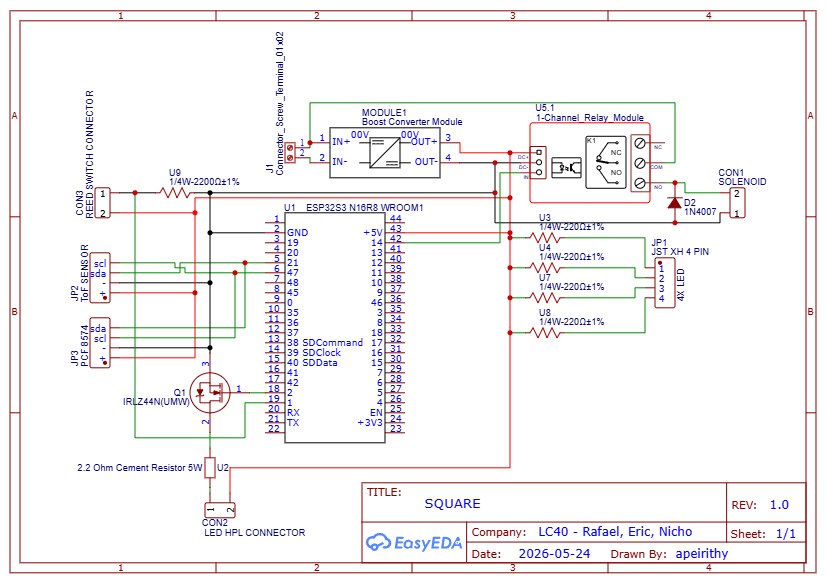

# Square: Smart & Secure Parcel Box (IoT Edge-to-Cloud System)

An end-to-end Internet of Things (IoT) solution designed to secure residential package deliveries. Built around the ESP32-S3 microcontroller running FreeRTOS, this project integrates multi-sensor edge processing, physical actuation, and Firebase cloud synchronization to provide courier authentication, visual evidence capture, and remote management.

## Project Demonstration
* **Live System Demo & Technical Walkthrough:** [https://youtu.be/-ZhSldYhqhk]

  

## System Architecture & Key Implementations

### 1. Edge Processing & Real-Time Control (FreeRTOS)
The firmware leverages FreeRTOS to manage hardware concurrency and prevent resource collisions across the ESP32-S3's dual cores:
* **Task Isolation:** Separated network operations (Core 0) from time-critical hardware control and UI feedback (Core 1).
* **Multi-Tasking:** Managed independent tasks for Firebase synchronization (`Task_Network`), user input (`Task_Keypad_LED`), security state machine (`Task_StateMachine`), and media processing (`Task_Media`).
* **Resource Protection:** Utilized FreeRTOS Mutexes to secure shared buses (I2C, SPI) and Non-Volatile Storage (NVS) access.

### 2. Multi-Sensor Perception & Actuation
* **Authentication:** A $3\times4$ Matrix Keypad for local PIN input, securely validating against credentials cached in NVS.
* **Visual Evidence:** OV2640 camera captures MJPEG video during door opening and high-res photos upon closure, illuminated by a custom MOSFET-driven High-Power LED flash.
* **State Monitoring:** Magnetic reed switch detects door state, while a VL53L0X Time-of-Flight (ToF) sensor monitors internal capacity.
* **Security:** Actuates a 12V Solenoid lock via an isolated relay module upon successful authentication.

### 3. Cloud Synchronization & Failsafe Mechanisms
* **Firebase RTDB & Cloud Storage:** Synchronizes device status, delivery logs, and large media files (photo/video) using Server-Sent Events (SSE) and HTTPS.
* **Offline Buffering:** In the event of network disruption, all media and logs are buffered to a local MicroSD card using a custom FIFO auto-deletion queue. Uploads automatically resume once connectivity is restored.

  

## Hardware Engineering
* **Custom Enclosure & Mounts:** Key mechanical components, including camera mounts and sensor brackets, were custom-designed in Tinkercad and 3D printed (PLA).
* **Circuit Design:** Routed and planned the entire electrical schematic via EasyEDA, ensuring safe logic-level isolation for high-current actuators.

## Repository Contents
* **[`/Firmware_src`](./Firmware_src):** ESP32-S3 C++ source code (PlatformIO/Arduino framework).
* **[`/Hardware_Design`](./Hardware_Design):** Circuit schematics and 3D printable `.stl` files.
* **[`/Docs`](./Docs):** Comprehensive technical documentation, including the Final Report, Functional Specification Document (FSD), and Project Proposal.
* **[`/Assets`](./Assets):** Project logo and mobile application interface screenshots.
